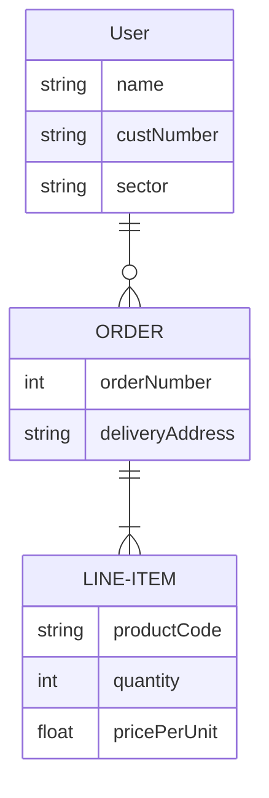
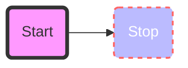
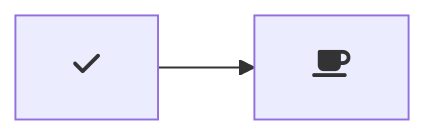

# Test docs

test
hello

Github pages :100:

napiszmy coś jeszcze

```javascript
alert();
```

```apex
String t = "test";
System.debug(true);
```





## Sub topic



#Some more
123

<!-- tabs:start -->

#### ** English **

Hello!

#### ** French **

Bonjour!

#### ** Italian **

Ciao!

<!-- tabs:end -->

!> **Time** is money, my friend!

?> **Time** is money, my friend!

Sample alert using type NOTE

> [!NOTE]
> An alert of type 'note' using global style 'callout'.
> Sample alert using type TIP

> [!TIP]
> An alert of type 'tip' using global style 'callout'.
> Sample alert using type WARNING

> [!WARNING]
> An alert of type 'warning' using global style 'callout'.
> Sample alert using type ATTENTION

> [!ATTENTION]
> An alert of type 'attention' using global style 'callout'.

Updated: {docsify-updated}

<details>
<summary>Self-assessment (Click to expand)</summary>

<div style='color: red'>

-   listitem
-   listitem
-   listitem

</div>

</details>
